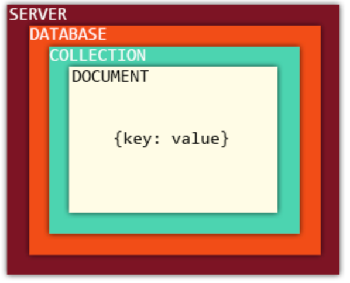

# Database

~~~
## content

• About Database

• Database Classification

• Database Ranking

• About MySQL

• RDBMS

• NoSQL
~~~

### Database Classification

- RDBMS
  - Relational Database Management System
  - Oracle, Mysql, Postgresql, Sqlite
  - 데이터 테이블 사이에 키값으로 관계를 가지고 있는 데이터베이스
  - 데이터 사이의관계 설정으로 최적화된 스키마를 설계 가능

  - Feature
      - 데이터 분류, 정렬, 탐색속도가 빠름
      - 오래 사용된 만큼 신뢰성이 높음
      - 스키마수정이 어려움

- NoSQL
   - Mongodb, Hbase, Cassandra
   -  데이터 테이블 사이에 관계가 없이 저장하는 데이터베이스
   - 데이터 사이의 관계가 없으므로 복잡성이 줄고 많은 데이터를 저장 가능

   - Feature
       - NoSQL : Not Only SQL
       - RDBMS의 한계를 극복하기 위해 만들어진 데이터 베이스
       - 확장성이 좋음 - 데이터의 분산처리 용이
       - 데이터 저장이 유연함 - RDBMS와 다르게 구조의 변경이 불필요
       - 스키마(Schema) 및 Join이 없음
       - Collection 별로 관계가 없기 때문에 모든 데이터가 들어있어야 함
       - 저장되는 데이터는 Key- Value 형태의 JSON 포멧을 사용
       - Select는 RDBMS 보다 느리지만 Insert가 빨라 대용량 데이터 베이스에 많이 사용됨
       - 트랜젝션(transaction)이 지원되지 않음 (동시수정에 대한 신뢰성이 지원되지 않음)

## Mongodb 를 깔아보자
- MongoDB는 C++로 작성된 오픈소스 NoSql 데이터 베이스 입니다. NoSql 중에서는 가장 많이 사용되고 있는
데이터 베이스 입니다. NoSql은 관계형 데이터 베이스 RDBMS가 아니기 때문에 고정된 스키마 및 JOIN이 없
습니다

- step 1
  - mongodb 를 설치하기 위해서는 우분투에 저장소(repository) 를 추가해주어야 한다. 아래의 커맨드로 추가 생성해 준다.
~~~
sudo apt-key adv --keyserver hkp://keyserver.ubuntu.com:80 --recv 2930ADAE8CAF5059EE73BB4B58712A2291FA4AD5
~~~

- step 2
  - 우분투 저장소를 추가해주었다면, 우리의 시스템에 mongdb 저장소를 추가해주자.
~~~
echo "deb [ arch=amd64,arm64 ] https://repo.mongodb.org/apt/ubuntu xenial/mongodb-org/3.6 multiverse" | sudo tee /etc/apt/sources.list.d/mongodb-org-3.6.list
~~~

- step 3
  - 이제 설치해주자.
~~~
sudo apt update
sudo apt install -y mongodb-org
~~~

- step 4
  - 설치가 되었다면, 아래의 세 개의 라인으로 mongodb 의 시스템을 켜고, 끄고, 오퍼레이팅 가능하게끔 조절할 수 있다.
  - systemctl 은 리눅스에서 서비스의 플로우를 조절하는 명령어이다.
~~~
sudo systemctl stop mongod.service
sudo systemctl start mongod.service
sudo systemctl enable mongod.service
~~~

## 이제 공부를 해보자

- 위의 코드에서 `sudo systemctl start mongod.service` 를 명령하고, `mongo` 라고 입력하여 서버를 오버레이팅해준다.
- 데이터 베이스 만들기 , 사용할 데이터 지정
~~~
> use first_db
switched to db first_db
~~~
- 현재 사용 중인 데이터 베이스 확인
~~~
> show dbs
admin   0.000GB
config  0.000GB
local   0.000GB
~~~
- 데이터 베이스에 데이터 넣기
~~~
> db.user.insert({"name":"alice", "age":20, "email":"alice.gmail.com"})
WriteResult({ "nInserted" : 1 })

> show dbs
admin     0.000GB
config    0.000GB
first_db  0.000GB
local     0.000GB
~~~
- 데이터 베이스 삭제하기
~~~
> db.dropDatabase()
{ "dropped" : "first_db", "ok" : 1 }
~~~
  - 데이터 베이스를 삭제하는 것은, 현재 사용 중인 DB를 삭제하는 것이기 때문에, 명령어를 실행하기 전에, use [db name]으로 어떠한 데이터 베이스를 삭제할 것인지 명시해주는 습관을 들여야 한다.

- collection 만들기
  - collection 을 만들 때에는 파라미터들이 충분 조건으로 들어가게 된다.
    - capped : true 로 설정되면 collection 의 최대 용량 즉, capacity 가 설정되어 데이터가 해당 용량을 넘어서 들어가게 되면 오래된 데이터부터 자동으로 삭제된다. 여기서 해당 용량은 size 파라미터에서 명시된다.
    - autoIndex : true 로 설정되면 `_id` 필드에 index 를 자동으로 생성한다.
    - size : 숫자 데이터를 사용하며 capped 의 최대 사이즈를 byte 단위로 지정하게 된다.
    - max : 숫자 데이터를 사용하며 최대 document 의 갯수를 설정한다.

~~~
> db.createCollection('user')
{ "ok" : 1 }

> db.createCollection('infor',{autoIndexId:true,max:5})
{
	"note" : "the autoIndexId option is deprecated and will be removed in a future release",
	"ok" : 1
}

> db.articles.insert( {"title":"data science", "contents":"mongodb" } )
WriteResult({ "nInserted" : 1 })
 # createCollection 명령어 대신 바로 collection의 이름을 명시해줄 수도 있다.

> show collections
articles
infor
user

> db.articles.drop() # articles 이라는 collection 을 삭제해주는 명령어 drop이다.
true

~~~

- 데이터 베이스를 만들었고, 그 안에 컬렉션을 생성하였고, 이제 그 안에 문서(document)를 써주어야 한다.

- 아래의 예시는 한 개의 document 를 각각 추가해주는 방식이다.
~~~
> db.info.insert({ "subject":"python", "level":3 })
WriteResult({ "nInserted" : 1 })

> db.info.insert({ "subject":"web", "level":1 })
WriteResult({ "nInserted" : 1 })

> db.info.insert({ "subject":"sql", "level":2 })
WriteResult({ "nInserted" : 1 })

> db.info.find()
{ "_id" : ObjectId("5be5c48026a701923a9bbf7d"), "subject" : "python", "level" : 3 }
{ "_id" : ObjectId("5be5c48926a701923a9bbf7e"), "subject" : "web", "level" : 1 }
{ "_id" : ObjectId("5be5c48d26a701923a9bbf7f"), "subject" : "sql", "level" : 2 }
~~~

- 아래의 예시는 3개의 document 를 한 번에 기입해주는 방식이다. 자세히 보게 되면, 리스트 안에 3개의 딕셔너리가 할당되어 있는 것을 알 수 있다. 이는, 위에서 언급했던 것과 같이 NoSQL에서 저장되는 데이터는 Key- Value 형태의 JSON 포멧을 사용한다고 했는데, 이와 같은 것이다.

~~~
> db.info.insert([{'subject':'python','level':3},{'subject':'web','level':1},{'subject':'sql','level':2}])

BulkWriteResult({ #한 번에 많은 데이터를 동시적으로 넣어주기 때문에, BulkWriteResult 라고 나온 것 같다.
	"writeErrors" : [ ],
	"writeConcernErrors" : [ ],
	"nInserted" : 3,
	"nUpserted" : 0,
	"nMatched" : 0,
	"nModified" : 0,
	"nRemoved" : 0,
	"upserted" : [ ]
})
~~~

- find 문을 살펴보자
  - find문은 특정한 쿼리(query)문을 포함해서 특정 데이터를 호출하는 개념이다.
  - `db.collection.find(query, projection)`
  - query : document 조회 조건을 설정. 모든 document를 조회 할때는 ({})를 사용
  - projection : document를 조회할때 보여지는 필드(컬럼)를 정의

~~~
> db.info.find({})
{ "_id" : ObjectId("5be5c48026a701923a9bbf7d"), "subject" : "python", "level" : 3 }
{ "_id" : ObjectId("5be5c48926a701923a9bbf7e"), "subject" : "web", "level" : 1 }
{ "_id" : ObjectId("5be5c48d26a701923a9bbf7f"), "subject" : "sql", "level" : 2 }
{ "_id" : ObjectId("5be5c51826a701923a9bbf80"), "subject" : "python", "level" : 3 }
{ "_id" : ObjectId("5be5c51826a701923a9bbf81"), "subject" : "web", "level" : 1 }
{ "_id" : ObjectId("5be5c51826a701923a9bbf82"), "subject" : "sql", "level" : 2 }
{ "_id" : ObjectId("5be5c55926a701923a9bbf83"), "subject" : "python", "level" : 3 }
{ "_id" : ObjectId("5be5c55926a701923a9bbf84"), "subject" : "web", "level" : 1 }
{ "_id" : ObjectId("5be5c55926a701923a9bbf85"), "subject" : "sql", "level" : 2 }
~~~

## query
- 기본 document 조회
- 비교 연산자
- 논리 연산자
- $where 연산자
- $elemMatch 연산자
- $exists 연산자

아래에서부터는 내일 마저 하겠다 :)
